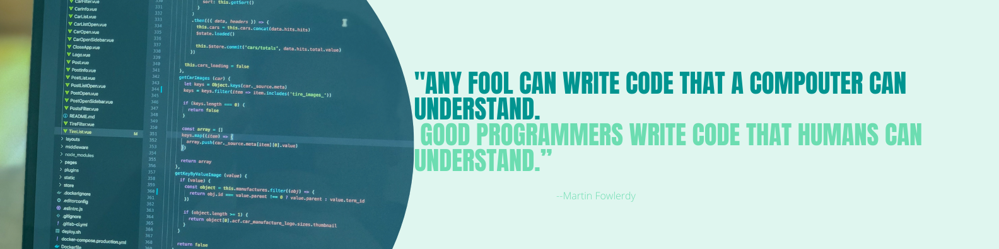

<h1 align ="center">Hi, I'm Chaitanya Pratap Singh</h1>
<h3 align = "center"><strong>A Student 👨🏻‍🎓 and a Programming Enthusiast 👩‍💻 from India </h3>

<h2 style="font-size:30px"><b> 🙋🏻‍♂️ About ME <b></h2>
<ul>
<li>I love to learn to code in differnt languages</li>
<li>I am looking forward to contribute on Open Source Projects💻</li>
<li>Ask me about <a src ="https://www.java.com/en/" >Java</a> </li>
<li>📭 Reach me at my mail @chaitanyapratapsingh24@gmail.com</li>
<ul>

<h2 style="font-size:30px" align ="left" width = 100%><u>Tools and Technologies</u></h2>

           

 

<h2  > Connect with me</h2>

   

   

   

   

   

  
## 📊 My Github Stats

   
    
  
   
  <b>Note:</b> Top languages is only a metric of the languages my public code consists of and doesn't reflect experience or skill level.
  

  ## ❤ Views and Followers

